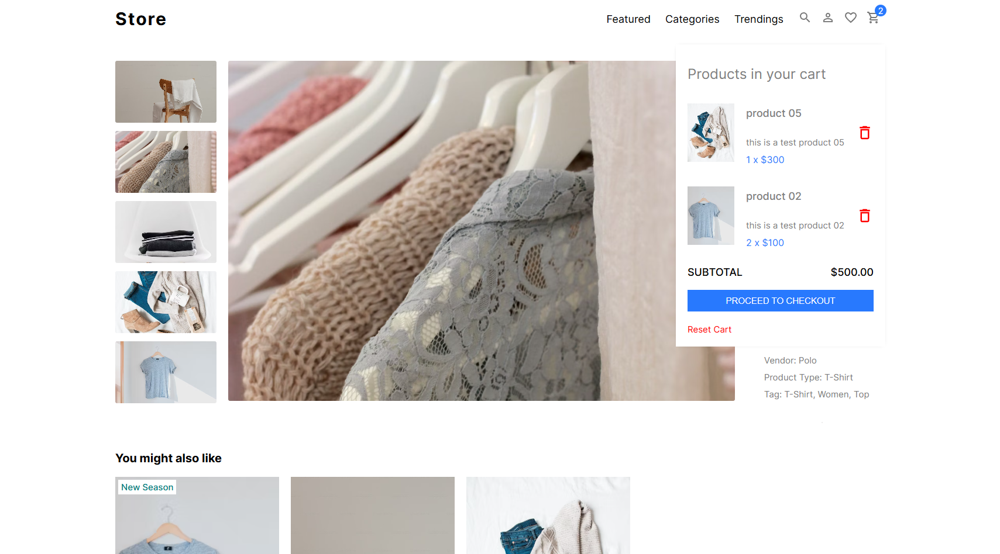

# Next.js E-commerce with Strapi #101

This repository showcases a fully functional e-commerce application built using the latest versions of Next.js, TypeScript, and Strapi CMS.
For learning Strapi CMS.

**🎉 Key Features:**

- **Tech Stack:** Next.js (latest), TypeScript, Redux, Strapi, PostgreSQL, Stripe
- **Inspiration:** [Link to original repository](https://github.com/safak/youtube2022/tree/ecommerce) (adapted for this implementation) 🙏
- **Purpose:** For learning Strapi CMS

**👋 Getting Started:**

1. Clone this repository.
2. Install dependencies (`npm install` or `yarn install`).
3. Set up the appropriate environment variables in the `.env` file (database credentials, API keys, etc.).

```bash
# Database
DATABASE_CLIENT=postgres

# Stripe
STRIPE_SECRET_KEY=
CLIENT_URL=http://localhost:3000

# supabase database
DATABASE_URL=
DATABASE_SHEMA=public
DATABASE_POOL_MIN=1
DATABASE_POOL_MAX=100

NODE_ENV=production

# frontend .env:
NEXT_PUBLIC_STRAPI_API_TOKEN=
NEXT_PUBLIC_API_URL=
NEXT_PUBLIC_STRIPE_PUBLISHABLE_KEY=
```

**🚀 Deploy on Netlify**

Create a file called `netlify.toml` in the root of your project. Copy and paste the code snippet below into the netlify.toml file.

```bash
[build]
  command = "npm run build"
  publish = ".next"

[[plugins]]
  package = "@netlify/plugin-nextjs"
```

Install the Netlify dependency package

```bash
npm i @netlify/plugin-nextjs
```


**🖼️ Screenshot:**



**👋 Contributions Welcome!**

Encouraging constructive feedback and pull requests to enhance this project.

**⚠️ Disclaimer:**

This repository is currently under development. I will continuously improve and document it. Stay tuned for updates!


**🎉 Live site:** https://next-e-com-with-strapi-101.netlify.app
